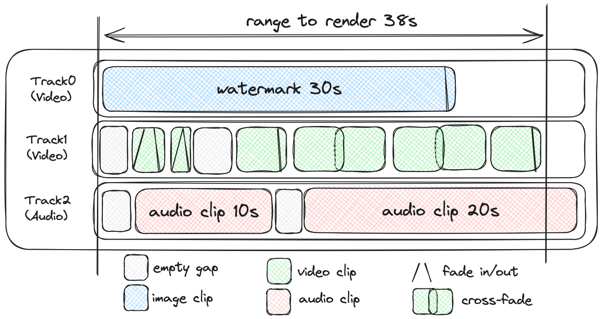

# json-to-ffmpeg
Experimental JSON to ffmpeg filter complex converter.

### Features
* Supports video, audio and image sources
* Clip transformation: scale, position, rotation, opacity
* For non-linear video editing with multiple tracks and clips
* Minimalistic JSON format
* No direct ffmpeg or node dependency required

## Example
Tool translates video description from JSON to ffmpeg filter complex. 
For example let's say we have following timeline in GUI video editor:



The timeline description in JSON format:

```json
{
  "inputs": {
    "source1": {
      "type": "video",
      "file": "samples/bee1920.mp4",
      "hasAudio": false,
      "hasVideo": true,
      "duration": 40
    },
    "source2": {
      "type": "video",
      "file": "samples/book1920.mp4",
      "hasAudio": false,
      "hasVideo": true,
      "duration": 13
    },
    "source3": {
      "type": "video",
      "file": "samples/cows1920.mp4",
      "hasAudio": true,
      "hasVideo": true,
      "duration": 15
    },
    "source4": {
      "type": "video",
      "file": "samples/flowers1920.mp4",
      "hasAudio": true,
      "hasVideo": true,
      "duration": 21
    },
    "audio1": {
      "type": "audio",
      "file": "samples/ever.mp3",
      "hasAudio": true,
      "hasVideo": false,
      "duration": 181
    },
    "audio2": {
      "type": "audio",
      "file": "samples/weekend.mp3",
      "hasAudio": true,
      "hasVideo": false,
      "duration": 208
    },
    "watermark": {
      "type": "image",
      "file": "samples/flower.png",
      "hasAudio": false,
      "hasVideo": true,
      "duration": 0
    }
  },
  "tracks": {
    "track_with_some_videos": {
      "type": "video",
      "clips": [
        {
          "name": "clip1",
          "source": "source1",
          "timelineTrackStart": 3,
          "duration": 2,
          "sourceStartOffset": 10,
          "clipType": "video",
          "transform": {
            "x": 0,
            "y": 0,
            "width": 1920,
            "height": 1080,
            "rotation": 0,
            "opacity": 1
          },
          "transitions": []
        },
        {
          "name": "clip2",
          "source": "source2",
          "timelineTrackStart": 5,
          "duration": 1,
          "sourceStartOffset": 5,
          "clipType": "video",
          "transform": {
            "x": 0,
            "y": 0,
            "width": 1920,
            "height": 1080,
            "rotation": 0,
            "opacity": 1
          },
          "transitions": []
        },
        {
          "name": "clip3",
          "source": "source3",
          "timelineTrackStart": 10,
          "duration": 5,
          "sourceStartOffset": 3,
          "clipType": "video",
          "transform": {
            "x": 480,
            "y": 270,
            "width": 960,
            "height": 540,
            "rotation": 45,
            "opacity": 0.5
          },
          "transitions": []
        },
        {
          "name": "clip4",
          "source": "source1",
          "timelineTrackStart": 15,
          "duration": 5,
          "sourceStartOffset": 27,
          "clipType": "video",
          "transform": {
            "x": 0,
            "y": 0,
            "width": 1920,
            "height": 1080,
            "rotation": 0,
            "opacity": 1
          },
          "transitions": []
        },
        {
          "name": "clip5",
          "source": "source2",
          "timelineTrackStart": 20,
          "duration": 5,
          "sourceStartOffset": 0,
          "clipType": "video",
          "transform": {
            "x": 50,
            "y": 50,
            "width": 400,
            "height": 300,
            "rotation": 0,
            "opacity": 1
          },
          "transitions": []
        },
        {
          "name": "clip6",
          "source": "source4",
          "timelineTrackStart": 25,
          "duration": 5,
          "sourceStartOffset": 15,
          "clipType": "video",
          "transform": {
            "x": 0,
            "y": 0,
            "width": 1920,
            "height": 1080,
            "rotation": 0,
            "opacity": 1
          },
          "transitions": []
        },
        {
          "name": "clip7",
          "source": "source4",
          "timelineTrackStart": 30,
          "duration": 5,
          "sourceStartOffset": 0,
          "clipType": "video",
          "transform": {
            "x": 0,
            "y": 0,
            "width": 1920,
            "height": 1080,
            "rotation": 0,
            "opacity": 1
          },
          "transitions": []
        },
        {
          "name": "clip8",
          "source": "source4",
          "timelineTrackStart": 35,
          "duration": 5,
          "sourceStartOffset": 10,
          "clipType": "video",
          "transform": {
            "x": 0,
            "y": 0,
            "width": 1920,
            "height": 1080,
            "rotation": 0,
            "opacity": 1
          },
          "transitions": []
        }
      ]
    },
    "track_with_watermark": {
      "type": "video",
      "clips": [
        {
          "name": "watermark_clip",
          "source": "watermark",
          "timelineTrackStart": 0,
          "duration": 30,
          "sourceStartOffset": 0,
          "clipType": "image",
          "transform": {
            "x": 1610,
            "y": 10,
            "width": 300,
            "height": 150,
            "rotation": 0,
            "opacity": 1
          }
        }
      ]
    },
    "track2": {
      "type": "audio",
      "clips": [
        {
          "name": "audio_clip1",
          "source": "audio1",
          "timelineTrackStart": 0,
          "duration": 20,
          "sourceStartOffset": 0,
          "clipType": "audio",
          "volume": 1
        },
        {
          "name": "audio_clip2",
          "source": "audio2",
          "timelineTrackStart": 20,
          "duration": 20,
          "sourceStartOffset": 0,
          "clipType": "audio",
          "volume": 1
        }
      ]
    }
  },
  "output": {
    "file": "output.mp4",
    "format": "mp4",
    "videoCodec": "libx264",
    "audioCodec": "aac",
    "width": 1920,
    "height": 1080,
    "bitrate": "1000k",
    "framerate": 30,
    "flags": [
      "-movflags",
      "+faststart",
      "-profile:v",
      "high",
      "-level",
      "4.2",
      "-crf",
      "18",
      "-pix_fmt",
      "yuv420p"
    ]
  }
}
```

will be translated using thi app into this command:

```bash
#!/bin/bash
ffmpeg -y \
-i samples/bee1920.mp4 \
-i samples/book1920.mp4 \
-i samples/cows1920.mp4 \
-i samples/flowers1920.mp4 \
-i samples/ever.mp3 \
-i samples/weekend.mp3 \
-i samples/flower.png \
-filter_complex "color=c=black:s=1920x1080:d=40[base];
color=c=black@0.0:s=1920x1080:d=3[gap_J04NOpTF];
color=black@0.0:s=1920x1080:d=2[biT5oq2u_base];
[0:v]trim=10:12,setpts=PTS-STARTPTS,scale=1920:1080,format=rgba,colorchannelmixer=aa=1[i0KrPE2h_clip];
[biT5oq2u_base][i0KrPE2h_clip]overlay=0:0:format=auto,rotate=0[clip1];
color=black@0.0:s=1920x1080:d=1[sNEjVzdt_base];
[1:v]trim=5:6,setpts=PTS-STARTPTS,scale=1920:1080,format=rgba,colorchannelmixer=aa=1[FPcXMNaU_clip];
[sNEjVzdt_base][FPcXMNaU_clip]overlay=0:0:format=auto,rotate=0[clip2];
color=c=black@0.0:s=1920x1080:d=4[gap_gVppvI6i];
color=black@0.0:s=1920x1080:d=5[E17bOyDf_base];
[2:v]trim=3:8,setpts=PTS-STARTPTS,scale=960:540,format=rgba,colorchannelmixer=aa=0.5[IMk5ppFu_clip];
[E17bOyDf_base][IMk5ppFu_clip]overlay=480:270:format=auto,rotate=45[clip3];
color=black@0.0:s=1920x1080:d=5[Xb5gEOAs_base];
[0:v]trim=27:32,setpts=PTS-STARTPTS,scale=1920:1080,format=rgba,colorchannelmixer=aa=1[pusVwtqI_clip];
[Xb5gEOAs_base][pusVwtqI_clip]overlay=0:0:format=auto,rotate=0[clip4];
color=black@0.0:s=1920x1080:d=5[UQd8xXAt_base];
[1:v]trim=0:5,setpts=PTS-STARTPTS,scale=400:300,format=rgba,colorchannelmixer=aa=1[lT7Ic6MU_clip];
[UQd8xXAt_base][lT7Ic6MU_clip]overlay=50:50:format=auto,rotate=0[clip5];
color=black@0.0:s=1920x1080:d=5[kDg5HR5S_base];
[3:v]trim=15:20,setpts=PTS-STARTPTS,scale=1920:1080,format=rgba,colorchannelmixer=aa=1[rMIHGm5W_clip];
[kDg5HR5S_base][rMIHGm5W_clip]overlay=0:0:format=auto,rotate=0[clip6];
color=black@0.0:s=1920x1080:d=5[J3VxwpAG_base];
[3:v]trim=0:5,setpts=PTS-STARTPTS,scale=1920:1080,format=rgba,colorchannelmixer=aa=1[zDaV4hWo_clip];
[J3VxwpAG_base][zDaV4hWo_clip]overlay=0:0:format=auto,rotate=0[clip7];
color=black@0.0:s=1920x1080:d=5[VVpphteg_base];
[3:v]trim=10:15,setpts=PTS-STARTPTS,scale=1920:1080,format=rgba,colorchannelmixer=aa=1[hOnlTueX_clip];
[VVpphteg_base][hOnlTueX_clip]overlay=0:0:format=auto,rotate=0[clip8];
[gap_J04NOpTF][clip1][clip2][gap_gVppvI6i][clip3][clip4][clip5][clip6][clip7][clip8]concat=n=10:v=1:a=0[track_with_some_videos];
color=black@0.0:s=1920x1080:d=30[YVZbEtOH_base];
[6:v]loop=loop=900:size=900,setpts=PTS-STARTPTS,scale=300:150,rotate=0,format=rgba,colorchannelmixer=aa=1[pJFLqzTM_clip];
[YVZbEtOH_base][pJFLqzTM_clip]overlay=1610:10:format=auto[watermark_clip];
color=c=black@0.0:s=1920x1080:d=10[gap_4R1fsKJF];
[watermark_clip][gap_4R1fsKJF]concat=n=2:v=1:a=0[track_with_watermark];
[4:a]atrim=0:20,asetpts=PTS-STARTPTS,volume=1[audio_clip1];
[5:a]atrim=0:20,asetpts=PTS-STARTPTS,volume=1[audio_clip2];
[audio_clip1][audio_clip2]concat=n=2:v=0:a=1[track2];
[base][track_with_some_videos]overlay=0:0[We9UosDP_combined_track];
[We9UosDP_combined_track][track_with_watermark]overlay=0:0[video_output];
[track2]amix=inputs=1:duration=longest[audio_output];" \
-map '[video_output]' -map '[audio_output]' -c:v libx264 -c:a aac -b:v 1000k -r 30 -s 1920x1080 -t 40 -movflags +faststart -profile:v high -level 4.2 -crf 18 -pix_fmt yuv420p output.mp4
```

## Usage

Install package:

```bash
npm install json-to-ffmpeg

# or 

yarn add json-to-ffmpeg

# or

pnpm add json-to-ffmpeg
```

Import and use it:

```javascript
import { parseSchema } from 'json-to-ffmpeg';

const ffmpegCommand = parseSchema(schema);
```

or if you need only filter complex part:

```javascript
const filterComplex = parseSchema(schema, true);
```

## Video, audio and image test samples
All samples are from [Pixabay](https://pixabay.com/). All samples are licensed under [Pixabay License](https://pixabay.com/service/license/).

* https://pixabay.com/videos/cow-ruminant-pasture-meadow-nature-186195/
* https://pixabay.com/videos/book-pages-literature-beach-ocean-185096/
* https://pixabay.com/videos/flower-peony-bee-insect-pollinate-165065/
* https://pixabay.com/videos/kangaroos-marsupials-mammal-181314/
* https://pixabay.com/videos/flower-dandelion-wild-flowers-72763/
* https://pixabay.com/videos/highland-cows-cows-cattle-scotland-65903/
* https://pixabay.com/videos/robin-bird-forest-nature-spring-21723/
* https://pixabay.com/music/beats-weeknds-122592/
* https://pixabay.com/music/future-bass-ever-flowing-12277/

## License
MIT